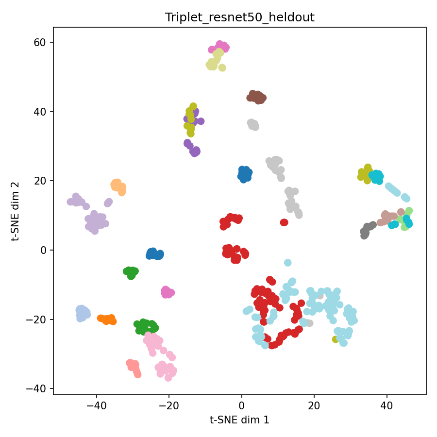
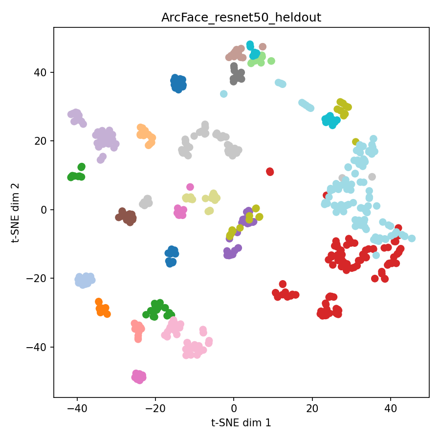

# Wildlife Face Recognition — Amur Tiger Re-ID

## Results
| Model | Rank-1 | Rank-5 | mAP |
|---|---|---|---|
| ArcFace (ResNet50) | 0.649 | 0.944 | 0.779 |
| Triplet (ResNet50) | 0.664 | 0.910 | 0.772 |
| ArcFace (EfficientNet-B0) | 0.667 | 0.906 | 0.767 |
| Triplet (EfficientNet-B0) | 0.673 | 0.875 | 0.766 |
| Softmax (ResNet50) | 0.646 | 0.893 | 0.747 |

## Embedding visualizations

